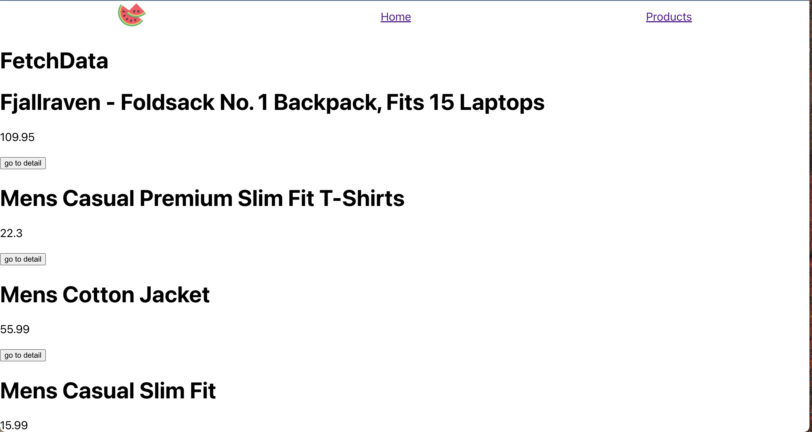
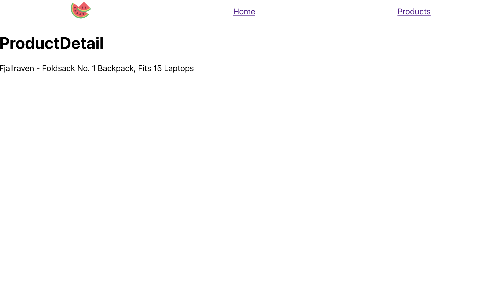

# React Routers Assignments

### How to run project

1. Step 1: yarn
2. Step 2: yarn start
  Deploy Link: https://isa-8-react-routes.vercel.app/

### Requirements

1. Install the `react-router-dom` package
2. Add 3 pages: home, products and product detail

### URL

1. To fetch product list: `https://fakestoreapi.com/products`
2. To fetch product detail: `https://fakestoreapi.com/products/productId`

### Screenshots

### Notes

the image and logo are in the `screenshots` folder
